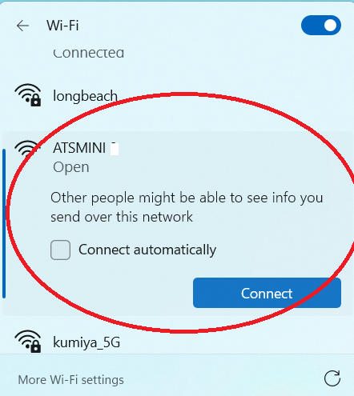

# ATS_MINI_WIFI_EN

Based on the following sources:

Volos Projects: https://github.com/VolosR/TEmbedFMRadio

PU2CLR, Ricardo: https://github.com/pu2clr/SI4735

Ralph Xavier: https://github.com/ralphxavier/SI4735

Goshante: https://github.com/goshante/ats20_ats_ex

G8PTN, Dave: https://github.com/G8PTN/ATS_MINI

Modified version to connect to Wi-Fi to retrieve date, time, and weather
conditions to display.
Date&Time from pool.ntp.org, time.nist.gov
Weather from https://open-meteo.com/

